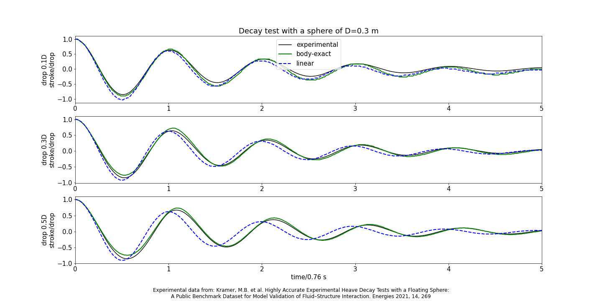

# The COERbuoy platform
### Body-exact simulation of heave-point absorber Wave Energy Converter - Version 0.3 beta 

 
## 1. Learn how to use COERbuoy
### 1.1 Basic usage
For a quick guide into using COERbuoy, please see section 3: Run COERbuoy. If you use jupyther, there is a [notebook available](https://github.com/SiHeTh/COERbuoy/blob/main/basic_usage.ipynb) with a few examples. The most comprehensive overview over COERbuoy is given in the [manual](https://github.com/SiHeTh/COERbuoy/raw/main/manual.pdf).
### 1.2 Writing a controller
Please see the examples using python or MATLAB in the [example section](https://github.com/SiHeTh/COERbuoy/tree/main/examples/custom_controller).
### 1.3 Writing a WEC
The inclusion of custom WECs is possible, but not offically suported. However, an example is [available](https://github.com/SiHeTh/COERbuoy/tree/main/examples/custom_WEC).

## 2. Installation

Download [python3](https://www.python.org/downloads/).

Install COERbuoy using pip:

| Variant 1          |
|:--------------------------|
|`py -m pip install COERbuoy`|             

| Variant 1              |
|:--------------------------------|
| `python3 -m pip install COERbuoy`|

## 3. Run COERbuoy

NOTE: The commands how to run python might differ between systems, and the ones presented here might not work on every machine. Please refer to https://www.python.org/ to find the correct commands for your system.

Run graphical user interface:

| Variant 1                    | &nbsp;&nbsp; | Variant 1              |
|:--------------------------|--------------|:--------------------------------|
|`py -m COERbuoy.GUI`       |              | `python3 -m COERbuoy.GUI      ` |

### 3.1. Command line:

Brettschneider wave with significant wave height 1.5 m and wave energy period of 6 s and a linear generator damping:

| Variant 1                    |
|:--------------------------|
|`py -m COERbuoy --bretschneider_wave 1.5 6 results.csv linear`|             

| Variant 1             |
|:--------------------------------|
| `python3 -m COERbuoy --bretschneider_wave 1.5 6 results.csv linear`|

Regular wave with height 1.5 m and period of 6 s and a linear generator damping:

| Variant 1                    |
|:--------------------------|
|`py -m COERbuoy --regular_wave 1.5 6 results.csv linear`|             

| Variant 1              |
|:--------------------------------|
| `python3 -m COERbuoy --regular_wave 1.5 6 results.csv linear`|

## 4. Version history
- 0\.3
   - fixed several bugs
   - radiation wave depends on body motion not on relative wave-body motion
   - new wave handling: negative time values describe transient time
   - improvements in GUI
   - added numpy example notebook
- 0\.2
   - manual added
   - settings tab added in GUI
   - simplify use of custom controller (via new folder and automatical detection of ocatve/python interpreter)
- 0\.1\.2 
   - added compatibility with numpy version > 1.16
